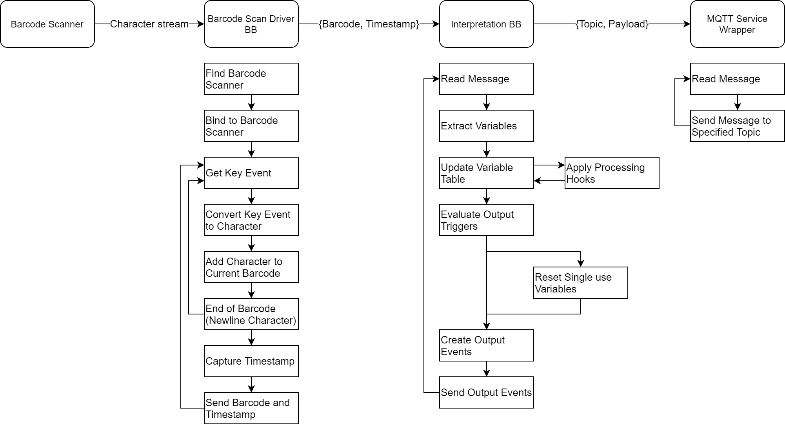

# Shoestring Barcode Scanning Service Module
## Description
This data collection service module uses a handheld barcode scanner(*) to capture data from barcodes. This data is then used to create events which are transmitted on the service layer (as defined in the configuration file).

(*)If multiple barcode scanners are needed then mutliple copies of this service modules should be used (this can be done on a single computing device).
## Hardware required
- USB barcode scanner
  - Any make/model (that supports USB HID as a keyboard style input)
  - 1D or 2D
  - wired or wireless

- Microcomputer with Linux-based operating system (Raspberry Pi recommended)
  - Including power supply, SD card, etc. as required

**During setup:** (not required once deployed)
- USB Keyboard
- USB Mouse
- Screen with HDMI input

## Installation
The code is available here on Github.

There are pre-compiled docker images for some architectures available on dockerhub [here](https://hub.docker.com/r/digitalshoestring/barcode_dc).
## How it works
The service module has three building blocks and a service wrapper. The building blocks are the barcode scanner, a barcode scan driver BB and an interpretation building block which extracts the relevant data from the scanned barcodes and forms it into the desired outputs. The schematic below is a flow chart showing what each building block does: 

## Configuration
The service module is configured using the `config.toml` file. A description of this file format can be found [here](https://toml.io/en/ "here").
### Barcode Scanner
The scanner is configured as follows:
```
[input.scanner]
serial="0581_0115"
connection_point=["0","1.1"]
```
#### serial
The `serial` is the USB scanner's serial number with the two segments separated by an underscore (e.g. `0581_0115`). A simple way to find this is using the `lsusb` command in the terminal which gives an output like this:
```
Bus 002 Device 001: ID 1d6b:0003 Linux Foundation 3.0 root hub
Bus 001 Device 003: ID 0581:0115 Racal Data Group Barcode Scanner
Bus 001 Device 002: ID 2109:3431 VIA Labs, Inc. Hub
Bus 001 Device 001: ID 1d6b:0002 Linux Foundation 2.0 root hub
```
Where the serial number is the portion after `ID` (remember to remove the`:`). To work out which one is the barcode scanner run `lsusb` with the barcode scanner plugged in and plugged out and check which entry is different.
#### connection_point
The `connection_point` is the identification path of the USB device. When two or more scanners with the same serial number are attached to the same microcomputer (e.g. the same brand and model), this is used to distinguish between them based on the USB port they are connected to.
The identification path can be identified by running `ls /dev/input/by-path` (once again, run plugged in and out to identify which one). The output will look something like this:
```
platform-fd500000.pcie-pci-0000:01:00.0-usb-0:1.1:1.0-event-kbd
platform-fd500000.pcie-pci-0000:01:00.0-usb-0:1.1:1.1-event
platform-fd500000.pcie-pci-0000:01:00.0-usb-0:1.3:1.0-event-kbd
platform-fd500000.pcie-pci-0000:01:00.0-usb-0:1.3:1.1-event
platform-fef00700.hdmi-event
platform-fef05700.hdmi-event
```
There tends to be two entries for each USB device (e.g. `usb-0:1.1:1.0-event-kbd` and `usb-0:1.1:1.1-event` are for the same device). In the case of the top entry, the identification path is the **0:1.1** portion of the `...usb-0:1.1:1.0-event` output. From this path, the connection point could be `["0"]` or `["0","1.1"]`, however in this case you would need to use `["0","1.1"]` for the top entry and `["0","1.3"]` for the lower entry to distinguish between the two.

If all serial numbers are different and this functionality is not needed, the `connection_point` should be set to `['*']`.
### Variable Extraction
The first stage of interpretation is to extract variable from barcodes. This service module supports three different types of variables ___static___, ___retained___ and ___single-use___. 

___Static___ variables are set in the configuration file and do not change during operation. For example, identifying information, such as the scan location in a job tracking solution, which the service module sends with every output .

___Single-use___ variables are extracted from barcodes. Once a single-use variable has been used to generate an output, it is cleared. This means that single-use variables are best suited to data that should be scanned fresh for each output event. (e.g. the job number in job tracking)

___Retained___ variables are similar to single-use variables in that their values are extracted from barcodes (an initial value can be set), however they are not cleared between outputs. This means that they can be used for data that should be applied to multiple outputs following a single scan. For example in job tracking this would be a job type or batch number that is scanned once and then included in all subsequent output messages generated when jobs are scanned.

Variables are configured as follows:
```
[[variable]]
    name="location"
    type="static"
    value="Painting"

[[variable]]
    name="id"
    type="single"
    pattern="j_(.*)"  # regex 

[[variable]]
    name="batch"
    type="retain"
    pattern="b_(.*)" # regex 
    initial="not_set"   # optional
```
To determine which variable a scanned barcode should be applied to, the `pattern` (which is a regular expression) for each variable is applied (starting from the top) and the first successful match is used. The first regex group (defined with brackets) within the match is extracted as the payload - so a barcode containing `b_1236` will match the `b_(.*)` pattern for the `batch` variable and the extracted value will be `1236` from the `(.*)` grouping.

The variable `name` is used to reference the variable in the processing and output parts of the config file as described in the next sections.

### Processing
The second stage of interpreation is to apply processing operations. This stage is optional, and can be used to apply a function to a variable and transform it into one or more other variables. The config is as follows:
```
[processing]
    directory="functions"
    process.enum_mode={apply_to="raw_mode",module="mode_enumeration",output_as=["mode"],extra_args=[]}
```
The `directory` is the folder where all of the processing modules are stored.

Each processing operation is defined using the form `process.<name>={config}` where `name` is a label given to the processing operation (`enum_mode` in the example above). The process operation is configured using: 

| key | description|
|---|---|
|`apply_to`| Which variable the operation is applied to |
| `module` | The module in `directory` that contains the processing function |
| `output_as` | A set of variable names used to store the results |
| `extra_args` | Additional arguements passed to the processing function |

When a variable is updated, the interpretation buidling block checks if there any processing operations applied to it (defined using `apply_to`), if there are - it import the `module` from `directory` and tries to call a function named `function` within that module using the `name` of the variable, the `value` of that variable and the `extra_args`. If it is successful, the outputs are mapped onto the variables in `output_as`.

Below is an example processing function for converting a *mode* varibale from a string to a single letter (either *I* or *O*). Using the example configuration above this would be saved in `functions/mode_enumeration.py`
```
def function(name, value, extra):
    mapping = {"receive": "I", "send": "O"}
    return [mapping[value]]
```

### Outputs
The final stage of interpretation is to combine variables to form output messages. Outputs are configured as follows:
```
[[output]]
    name = "scan event"   # only used in logging
    topic = "{{location}}/feeds/jobs"
    triggers = ["id"]
    trigger_policy="all"
    payload.job_id="id"
    payload.location="location"
    payload.timestamp="timestamp"
```

 key | description 
---|---
 `name` | Name of the output
 `topic` | Topic to which the output is written. Variables can be included by wrapping them in double curly brackets e.g. `{{name}}`.
 `triggers` | Variables that define when the output is generated
 `trigger_policy` | `any` (default) or `all`. If `any` the output is sent whenever one of the `trigger` variables changes. If `all` the output is sent when all of the `trigger` variables have changed.
 `payload.<output_tag>=<variable>` | Used to define output message. 

 All output messages are flat `json` formatted strings. The config above would create the following message for variables `id`="ab12345" and `location`="Painting":
 ```
 {
  "job_id":"ab12345",
  "location":"Painting",
  "timestamp":"2022-10-26T14:28:56+01:00"
 }
 ``` 
 `timestamp` is a special variable which contains an ISO8601 datetime string of the last scan.

### Service Layer
This service module supports service layer communication over MQTT. The configuration for the MQTT connection is as follows:
```
[service_layer.mqtt]
    broker="broker_url_here"
    port=port_number_here

    reconnect.initial = t_initial # seconds
    reconnect.backoff = t_backoff # multiplier
    reconnect.limit = t_limit # seconds
```
#### broker
`broker` is the url or ip address of the MQTT broker (e.g. `mqtt.docker.local`, `localhost` or `192.168.1.1`)
#### port
`port` is the port number used by the MQTT broker (typically `1883` or `8883`)
#### reconnect
The reconnect behaviour is governed by 3 variables the `initial` timeout, the `backoff` multiplier and the timeout `limit`. When the connection is lost, the system will try reconnect. If it can't, it will wait for the `initial` timeout and then try again. If this doesn't work it will continue to wait and retry, each time increasing the time it waits by multiplying the current wait time by the `backoff` multiplier. To prevent excessive growth of the wait time it is capped by the timeout `limit`.

*Pseudocode:*
```
# reconnection characteristics
try reconnect
timeout = initial,
while not connected
	wait for timeout
	try reconnect
	timeout = timeout*backoff
	if timeout > limit then
		timeout = limit
```
### Example:
This is an example of a complete config file for a job tracking solution:
```
[input.scanner]
serial="0c2e_0901"
connection_point=["0","1.1"]

[[variable]]
    name="location"
    type="static"
    value="Cutting"

[[variable]]
    name="id"
    type="single"
    pattern="job_(.*)"

[[variable]]
    name="type"
    type="retain"
    pattern="type_(.*)" # optional
    initial="not_set"

[[variable]]
    name="raw_mode"
    type="retain"
    pattern="dir_(.*)"
    initial="receive"

[processing]
    directory="functions"
    process.enum_mode={apply_to="raw_mode",module="mode_enumeration",output_as=["mode"],extra_args=[]}

[[output]]
    name = "scan event"   # only used in logging
    topic = "{{location}}/feeds/jobs"
    triggers = ["id"]
    trigger_policy="all"
    payload.job_id="id"
    payload.job_type="type"
    payload.location="location"
    payload.timestamp="timestamp"


[[output]]
    name = "mode change event"   # only used in logging
    topic = "{{location}}/control/mode_change"
    triggers = ["mode"]
    payload.mode_changed_to="mode"

[service_layer.mqtt]
    broker="mqtt.docker.local"
    port=8883

    #reconnection characteristics
    # start: timeout = initial,
    # if timeout < limit then
    #   timeout = timeout*backoff
    # else
    #   timeout = limit
    reconnect.initial = 5 # seconds
    reconnect.backoff = 2 # multiplier
    reconnect.limit = 60 # seconds
```

